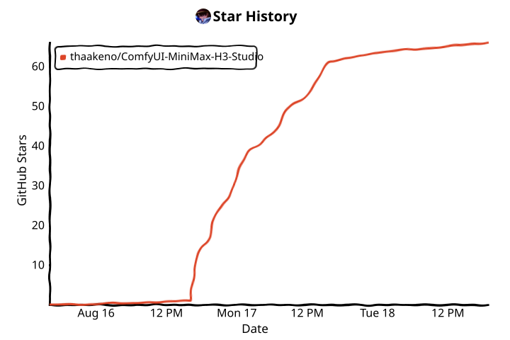

<div align="center">

# MiniMax H3 Studio

### Turn MiniMax H3 into an actual image workflow for ComfyUI.

Text-to-image, image editing, multi-reference generation, LightX acceleration, smart prompt prep, Face Refine, previews and benchmarking — without building the whole H3 graph yourself.

<p>
  <a href="https://github.com/thaakeno/ComfyUI-MiniMax-H3-Studio/stargazers"></a>
  
  
  
  
</p>

**One maintained workflow. H3 underneath. Far less wiring.**

</div>


> [!IMPORTANT]
> H3 Studio is still alpha. MiniMax H3 is an audio-video model being pushed into image-generation workflows here, so some paths are experimental and can change as ComfyUI and H3 support evolve. High-resolution generation is experimental; more pixels do not automatically mean more learned detail.

**Universal Asset Downloader (UAD) is optional; existing manually installed models work.**
<table>
<tr>
<td width="50%"></td>
<td width="50%"></td>
</tr>
</table>

> [!WARNING]
> **ComfyUI Nodes 2.0 is not supported yet.** H3 Studio's custom Director and Benchmark interfaces currently target classic Nodes 1.0. Nodes 2.0 UI support is still being worked on.

> [!NOTE]
> **An official image-specific H3 descendant is planned.** In the MiniMax H3 team AMA, H3 researcher Kiro Song said the team is deriving a dedicated image model from a common ancestor in the H3 lineage. It is expected to reuse H3's VAE encoder through weight slicing and receive a dedicated image-generation VAE decoder. MiniMax did not announce a release date or measured quality improvement, so H3 Studio's current still-image and experimental T=1 paths remain community solutions for now. [Read the team response.](https://www.reddit.com/r/StableDiffusion/comments/1vh9rtw/comment/p23ecga/)

## Why H3 Studio

Running H3 for images is possible in normal ComfyUI, but a serious setup quickly turns into model routing, reference conditioning, sampler profiles, frame selection, VAE handling, prompt tooling and a pile of utility nodes.

H3 Studio keeps that machinery behind a smaller image-focused interface while still using the real H3 FL2VA and REF2VA paths underneath.

## What it does

<table>
<tr>
<td width="50%" valign="top">

### One Image Director

Text-to-image, image-to-image and reference editing live in the same interface.

Choose the aspect ratio or exact output size, sampling profile, seed, runtime behavior and frame strategy without rebuilding the workflow.

</td>
<td width="50%" valign="top">

### Multi-reference H3

Add up to nine ordered references and address them directly as <code>@Image1</code> through <code>@Image9</code>.

Each image can own a different part of the result: identity, pose, outfit, style, composition, lighting, environment and more.

Reference cards preserve their role, retention policy, dimensions, fingerprint, description and thumbnail across workflow reloads.

</td>
</tr>

<tr>
<td width="50%" valign="top">

### Fast H3 paths

Use native Base sampling or accelerated LightX/PDD profiles.

The main fast FL2VA path is **LightX v1.0 8-step**, with a reduced four-step adapter and the older empirical LightX v0.1 profiles also available.

PDD provides an optional four-step REF2VA path.

</td>
<td width="50%" valign="top">

### Face Refine

Small and distant faces can be detected after the final H3 still is selected and rerendered through H3 at a larger crop.

YOLOv8-Face is the recommended detector. SAM is optional and improves the blend mask rather than replacing the detector.

</td>
</tr>

<tr>
<td width="50%" valign="top">

### Smarter prompt prep

Optional Qwen3-VL models can inspect references and turn a rough request into a cleaner H3 instruction.

Pixel analysis and prompt writing are kept separate and cached independently, with 4B, 8B and mixed analyzer/writer choices available.

</td>
<td width="50%" valign="top">

### Benchmarks without separate workflows

Benchmark Lab compares sampling profiles, resolutions and repeated seeds from the maintained workflow.

It reports the exact run count before queueing and tracks live progress, timings, aligned output dimensions, seeds and references.

</td>
</tr>
</table>

## Three generation paths

| Mode | H3 path | Use |
| --- | --- | --- |
| **Text to image** | FL2VA | Prompt-only generation without silently consuming uploaded references |
| **Image to image** | FL2VA | Use Image 1 as the source canvas while choosing the output size independently |
| **Reference edit** | REF2VA | Generate from one or more ordered reference images |

Auto routing selects the valid path for the current request instead of silently feeding references into the wrong mode.

Impossible PDD, REF2VA, forced-route and missing-reference combinations are rejected before expensive model work begins.


## Sampling and acceleration

H3 Studio keeps the actual recipe visible.

| Profile | Route | Steps | Notes |
| --- | --- | ---: | --- |
| **Base Quality** | FL2VA / REF2VA | 20 | Safest native quality baseline |
| **Base Balanced** | FL2VA / REF2VA | 12 | Faster native comparison |
| **LightX v1.0 FL2VA** | FL2VA | **8** | Official full v1.0 adapter and main accelerated FL2VA path |
| **LightX v1.0 pruned** | FL2VA | 4 | Kijai 768p rank-31 adapter |
| **LightX ER-SDE** | FL2VA / REF2VA | 4 | Empirical Kijai LightX v0.1 recipe |
| **LightX SA-Solver** | FL2VA / REF2VA | 4 | Alternate empirical Kijai LightX v0.1 recipe |
| **Mamad8 PDD 600 / 900** | REF2VA | 4 | Matching student LoRA + heads |

The LightX labels are intentionally artifact-specific. The full v1.0 eight-step profile follows the published LightX adapter, while the older v0.1 recipes are empirical ComfyUI recipes.

PDD is REF2VA-only and requires a valid reference context.

Conditioning uses separate prompt, reference, VAE and latent caches. Compatible current ComfyUI builds can use upstream chunked H3 VAE encode/decode, and NVFP4 32B conditioning is preferred when installed.

## Resolution

The Director exposes two planning modes.

**Conservative** keeps the older roughly 1 MP working area for predictable memory use.

**Direct** sends the aligned target canvas directly to H3 from roughly **0.2 MP through 8.5 MP**.

The Director always shows the real aligned dimensions and labels the draft, recommended, extended, experimental and extreme ranges.

Direct 2/4/8 MP generation is available for experimentation, but H3 Base is not a dedicated super-resolution model. Large canvases can sharply increase attention cost, decode time, RAM, VRAM and failure risk without producing proportional detail gains.

## Decode choices

Sampling speed and decoding are separate controls.

### Original H3 Video VAE

The normal quality/default path.

Choose 5, 9, 13 or 20 temporal frames. More candidates increase sampling and decoding work but allow H3 Studio to select from more generated frames.

Current ComfyUI builds can automatically use the upstream chunked H3 VAE path when available. Chunking greatly reduces peak decode memory while preserving decoded output, but it should be treated primarily as a memory optimization rather than a decode-speed switch.

### T=1 Image VAE

An optional experimental one-frame decoder based on Mamad8's H3 Image VAE.

It samples and decodes a single still latent and can be significantly lighter, but may soften typography, hair, fine contours and microtexture compared with the normal video VAE.

### TAEH3 previews

TAEH3 can provide lightweight live previews while H3 is sampling without repeatedly decoding the full H3 VAE.

## Face Refine

H3 can produce a strong wide composition while leaving a tiny background face looking rough.

Face Refine targets that specific problem.

The final still is selected first. H3 Studio detects eligible faces, crops the real source region, rerenders that crop through H3's native FL2VA image-conditioning path and blends the result back into the selected still.

It is not a generic sharpening or ESRGAN pass.

### Modes

- **Off** leaves the selected still untouched.
- **Auto** is conservative and refines at most one eligible face per output.
- **Strong** exposes multi-face refinement through the advanced `Max faces` control.
- **Refine canvas** ranges from 512 to 1536 px, with 768 px as the recommended default.

Each selected face adds another H3 diffusion pass, so larger refine canvases and multiple faces increase runtime and memory use quickly.

### Detection

The preferred detector is:

```text
face_yolov8m.pt
models/ultralytics/bbox/
````

H3 Studio prefers YOLO through [ComfyUI-Impact-Subpack](https://github.com/ltdrdata/ComfyUI-Impact-Subpack), then a local Ultralytics loader, MediaPipe if already installed, and finally the bundled OpenCV Haar fallback.

### Masking

The default blend uses a detector-anchored feather mask.

Optional SAM masking uses [Impact Pack](https://github.com/ltdrdata/ComfyUI-Impact-Pack) plus a checkpoint in:

```text
models/sams/
```

If SAM is unavailable, Face Refine safely falls back to feathering.

### Acceleration

When installed, Face Refine can use the dedicated LightX v1.0 four-step FL2VA adapter.

If that asset is missing, it can preserve or reuse another compatible FL2VA LightX profile — including the active v1.0 eight-step path — or fall back to Base Balanced instead of failing solely because the optional four-step adapter is absent.

### Inspection

The Director reports detector, selected and refined counts after the run and can save a before/after proof view.

Failed face crops preserve the original pixels unchanged.

## Prompt and reference behavior

H3 Studio keeps four jobs separate.

1. **Factual pixel analysis** describes visible reference content and is cached by image fingerprint.
2. **Reference ownership** assigns narrow responsibilities such as identity, pose, outfit, style, composition, object or environment.
3. **Generative prompt direction** turns the request and reference facts into a compact production instruction.
4. **Prompt compilation** converts friendly `@ImageN` mentions into H3's model-facing `<Picture N>` representation deterministically.

The maintained workflow uses Qwen3-VL 4B for automatic analysis and can reuse the same model for prompt writing or stage a separate 4B/8B writer.

Writer output targets a compact production prompt instead of dumping hundreds of unnecessary tokens into H3.

Malformed or truncated analyzer JSON is repaired or retried where possible, and useful fallback text is preserved.

Legacy forms such as `@Image 1` are accepted, while saved state is canonicalized to `@Image1`.

Reference editing remains semantic regeneration — not pixel-locked compositing or mask inpainting. Explicit ownership and retention instructions improve control but cannot guarantee exact geometry.

For example:

```text
Keep the identity and pose from @Image1.
Transfer only the jacket from @Image2.
Use the lighting from @Image3.
```

## Benchmark Lab

Benchmark Lab is a guarded matrix rather than a hard-coded A/B workflow.

Profiles, resolutions and repeats form the matrix axes.

Before execution, the node reports the exact number of generations and blocks oversized matrices unless explicitly allowed.

During execution it reports the active cell, completed and remaining counts, profile, aligned resolution, elapsed time and an ETA once enough completed cells exist to estimate one honestly.

Live cell previews are optional and can be disabled for maximum throughput.

The final comparison sheet can include the original references with correct `@ImageN` labels, the source prompt and useful cell metadata such as profile, seed, requested/real dimensions, repeat and sampling time.

## Quick start

1. Open [`example_workflows/H3_Studio_Unified_Image.json`](example_workflows/H3_Studio_Unified_Image.json).
2. Select your H3 FL2VA / REF2VA models, 32B text encoder and H3 VAE.
3. Write a prompt in **H3 Studio Director**.
4. Add references only when you actually need them.
5. Assign each reference a narrow role.
6. Choose a sampling profile, resolution mode, frame profile and seed behavior.
7. Queue.

## Install

Clone into `ComfyUI/custom_nodes`:

```bash
cd /path/to/ComfyUI/custom_nodes
git clone https://github.com/thaakeno/ComfyUI-MiniMax-H3-Studio.git
cd ComfyUI-MiniMax-H3-Studio
python -m pip install -r requirements.txt
git log -1 --format='Installed H3 Studio %h · %s'
```

Restart ComfyUI, hard-refresh the frontend and open the maintained workflow.

H3 Studio does **not** automatically download the core MiniMax H3 models.

Face Refine has a separate optional setup action for its detector and SAM dependencies.

### Reproducible release install

To install the current pinned release instead of following later development commits:

```bash
cd /path/to/ComfyUI/custom_nodes
git clone --branch v0.1.0-alpha.20 --depth 1 https://github.com/thaakeno/ComfyUI-MiniMax-H3-Studio.git
cd ComfyUI-MiniMax-H3-Studio
python -m pip install -r requirements.txt
```

### Development build

```bash
git clone --branch dev https://github.com/thaakeno/ComfyUI-MiniMax-H3-Studio.git
```

### Update an existing installation

```bash
cd /path/to/ComfyUI/custom_nodes/ComfyUI-MiniMax-H3-Studio
git pull --ff-only
git log -1 --format='Updated H3 Studio %h · %s'
```

## Models

| Component                                       | ComfyUI folder                       | Source                                                                                                                                                  |
| ----------------------------------------------- | ------------------------------------ | ------------------------------------------------------------------------------------------------------------------------------------------------------- |
| Pruned W4A8 FL2VA / REF2VA defaults             | `models/diffusion_models/`           | [Kijai/MiniMax-H3-experimental](https://huggingface.co/Kijai/MiniMax-H3-experimental)                                                                   |
| MiniMax H3 32B conditioning encoder             | `models/text_encoders/`              | [Comfy-Org/MiniMax-H3](https://huggingface.co/Comfy-Org/MiniMax-H3)                                                                                     |
| H3 Video VAE                                    | `models/vae/`                        | [Comfy-Org/MiniMax-H3](https://huggingface.co/Comfy-Org/MiniMax-H3)                                                                                     |
| Qwen3-VL 4B/8B analyzer / writer, optional      | `models/text_encoders/`              | [Comfy-Org/Qwen3-VL](https://huggingface.co/Comfy-Org/Qwen3-VL)                                                                                         |
| LightX H3 LoRAs, optional                       | `models/loras/`                      | [LightX2V/MiniMax-H3-Turbo](https://huggingface.co/lightx2v/Minimax-h3-Turbo) / [Kijai/MiniMax-H3_comfy](https://huggingface.co/Kijai/MiniMax-H3_comfy) |
| TAEH3 preview model, optional                   | `models/vae_approx/`                 | [Kijai/MiniMax-H3-TAE](https://huggingface.co/Kijai/MiniMax-H3-TAE)                                                                                     |
| PDD LoRA + heads, optional                      | `models/loras/`, `models/pdd_heads/` | [Mamad8 PDD](https://huggingface.co/Mamad8/MiniMaxH3_R2V-PDD-Turbo-LoRA-Mamad8)                                                                         |
| T=1 Image VAE, experimental                     | `models/vae/`                        | [Mamad8 Image VAE](https://huggingface.co/Mamad8/MiniMax-H3-Image-VAE)                                                                                  |
| Face Refine YOLO detector, optional/recommended | `models/ultralytics/bbox/`           | [Bingsu/adetailer](https://huggingface.co/Bingsu/adetailer)                                                                                             |
| Face Refine SAM model, optional                 | `models/sams/`                       | [Meta Segment Anything](https://github.com/facebookresearch/segment-anything)                                                                           |

PDD also requires the separately installed [ComfyUI-MiniMaxH3-PDD-Mamad8](https://github.com/mamad8c/ComfyUI-MiniMaxH3-PDD-Mamad8) package.

H3 Studio integrates its registered execution surface; it does not copy or bundle that GPL implementation.

## Image examples


## Validation and support

Local checks cover Python and frontend syntax, deterministic prompt compilation, state migration, workflow generation/schema, node registration, route validation, seed safety, PNG metadata restoration, Face Refine geometry/fallback behavior and artifact consistency.

CUDA speed, peak memory, optional third-party model availability and visual quality still require a real GPU run with the exact installed ComfyUI build.

If generation fails, open an [issue](https://github.com/thaakeno/ComfyUI-MiniMax-H3-Studio/issues) with the full traceback, ComfyUI version, GPU/VRAM, selected model filenames, route, profile, resolution and a workflow JSON or metadata PNG when safe.

<details>
<summary><strong>Development checks</strong></summary>

```bash
uv sync --extra dev
uv run ruff check h3studio tests tools
uv run pytest -q
npm run check
uv run python tools/generate_workflows.py --check
uv run python tools/validate_workflows.py
uv run python tools/audit_nodes.py
uv run python tools/release_check.py
```

</details>

## Credits and project boundaries

H3 Studio is its own project, but some foundations come from good work already happening around H3.

[ComfyUI-MiniMaxH3-Easy](https://github.com/nkxx188/ComfyUI-MiniMaxH3-Easy) provided foundations for the ordered media / mention interaction under MIT.

[ComfyUI-MiniMax-H3-Image-Studio](https://github.com/astropuzzo/ComfyUI-MiniMax-H3-Image-Studio) provided earlier image-oriented H3 resolution, decode and workflow foundations under the Unlicense.

[ComfyUI-H3-FaceRefine](https://github.com/Carasibana/ComfyUI-H3-FaceRefine) was a useful reference for crop-based H3 face refinement and source-latent injection.

Kijai, Mamad8, LightX2V, Comfy-Org, Impact Pack/Subpack and the optional detector/mask components remain external works under their published terms.

See [`THIRD_PARTY_NOTICES.md`](THIRD_PARTY_NOTICES.md) for the exact code and licensing boundaries.

H3 Studio is not endorsed by MiniMax, ComfyUI or any of the referenced projects.

## Project status

H3 Studio is actively developed and still alpha.

The core image workflow is working, but H3 itself was not released as a dedicated image model and some high-resolution, acceleration, UI and post-processing paths remain intentionally experimental.

## Star history

If H3 Studio makes H3 less painful to use, leave a star.

<div align="center">
<!-- star-history:start -->
<picture>
  <source media="(prefers-color-scheme: dark)" srcset="docs/assets/star-history/star-history-dark.svg">
  
</picture>
<!-- star-history:end -->
</div>

> [!NOTE]
> **What the GENERATED badge counts:** successful images saved through H3 Studio. It sends only a fixed `/generated` counter hit with session tracking disabled — never prompts, images, references, seeds, hardware details, paths or identifiers. Set `H3STUDIO_TELEMETRY=0` to opt out; [implementation details](telemetry/README.md) are public.

## License

Original H3 Studio code is available under the [MIT License](LICENSE).

Adapted files retain their upstream notices and terms. External models and optional custom nodes retain their own licenses.